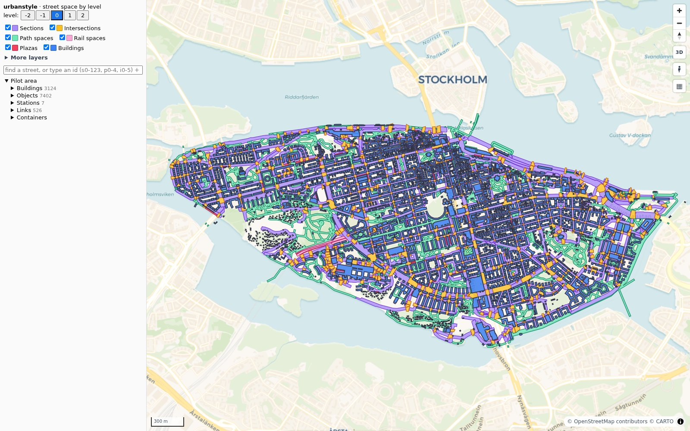
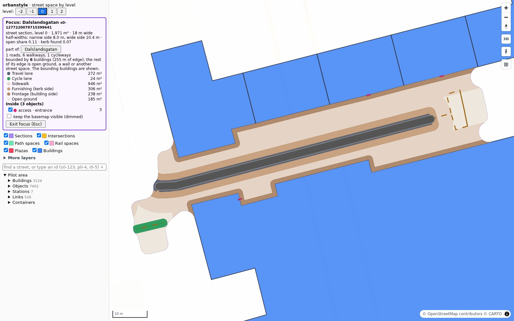

# urbanstyle

<p class="lead">The street space of a city, level by level: the right-of-way between the buildings, cut into sections and intersections, split into travelway and pedestrian realm, filled with strips and objects, and linked across levels. From one duckOSM database.</p>

<div class="us-hero" markdown>

</div>

<p class="us-caption">Södermalm, Stockholm, in the urbanstyle dashboard. Map data © OpenStreetMap contributors, base map © CARTO.</p>

```bash
pip install "urbanstyle[dashboard] @ git+https://github.com/Khoshkhah/urbanstyle"
```

```bash
urbanstyle build monaco.duckdb data/monaco.duckdb        # duckOSM in, space schema out
urbanstyle check data/monaco.duckdb                      # invariants: PASS / FAIL
urbanstyle dashboard data/monaco.duckdb viz/monaco.html  # offline map + tree
```

urbanstyle is the newest member of a family of tools on the same data. [duckOSM](https://github.com/Khoshkhah/duckOSM)
turns an `.osm.pbf` into a routable network in DuckDB, [roadstyle](https://khoshkhah.github.io/roadstyle/) draws its
roads, [mapstyle](https://khoshkhah.github.io/mapstyle/) the full base map, and
[lanestyle](https://khoshkhah.github.io/lanestyle/) its lanes. urbanstyle adds the **space**
between the buildings: what a street is made of, where one ends and the next begins, and what stands in it.

## What you get

<div class="grid cards" markdown>

-   :material-office-building-outline:{ .lg .middle } **A measured street space**

    ---

    Cross-section rays every 3 m out to the building faces: the right-of-way as it is, not a buffer of a constant width.

    [:octicons-arrow-right-24: Street space](design/street-space.md)

-   :material-vector-square:{ .lg .middle } **A clean partition**

    ---

    Sections, intersections, path spaces, rail spaces and plazas. No overlaps, no gaps, one connected polygon each, checked on every build.

    [:octicons-arrow-right-24: The specification](design/street-space-spec.md)

-   :material-layers-triple-outline:{ .lg .middle } **Levels −2 … 2**

    ---

    Bridges, tunnels, metro stations and the ramps, stairs, lifts and entrances that link them.

    [:octicons-arrow-right-24: Levels research](design/levels-research.md)

-   :material-format-list-group:{ .lg .middle } **Strips and objects**

    ---

    Every container filled with typed bands (travel, cycle, sidewalk, furnishing, frontage) and the trees, lamps, benches and crossings in it.

    [:octicons-arrow-right-24: Street objects](design/street-objects.md)

</div>

## One section, close up

<div class="us-hero" markdown>

</div>

Click a section in the dashboard: the panel lists its strips with their areas and the objects inside it, and the
map shows the buildings that bound it. Every square metre of open ground at a level belongs to exactly one
container. The words are in the [glossary](design/glossary.md).

## Where next

The [roadmap](plan.md) lists what is built, what is open and the order of work.
